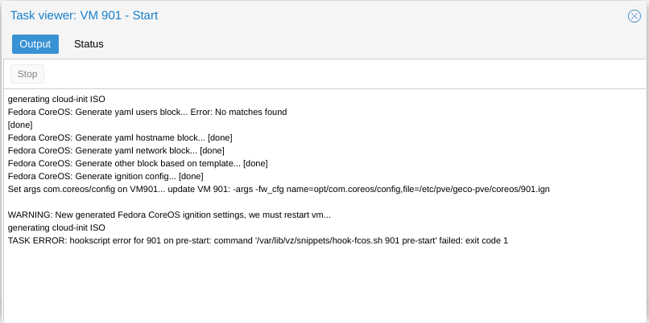

# fedora-coreos-proxmox
**This is a fork https://git.geco-it.net/public/fedora-coreos-proxmox**

Fedora CoreOS template for proxmox with cloudinit support

## My changes
Changed the branding
Enabled rootless podman socket for user core
Enabel lingering for user core
Deploy tailscale container
Deploy dockhand container with podman socket access
Added virtiofs auto mounting (discovered inside the VM via /sys/fs/virtiofs)
Containers only start when the virtiofs storage is mounted
Added ipv6 support
Added network configuration via the VM notes field (works for SR-IOV / passthrough NICs)
Network configuration is file based (NetworkManager keyfiles) and self-healing on every boot
Filtered tailscale socket for docktail (rootless) via wollomatic/socket-proxy

## Permissions
VirtioFS folder on the host need to be owned by user 1000:1000

## VirtioFS automounting

Virtiofs shares added to the VM in Proxmox are mounted automatically inside the VM:
`geco-virtiofs.service` runs `/usr/local/bin/geco-virtiofs` on every boot, which reads
the available device tags from `/sys/fs/virtiofs/<n>/tag`, generates a systemd mount
unit `var-mnt-<tag>.mount` per share (mounted at `/var/mnt/<tag>`) and removes mounts
whose device is gone. No configuration on the host side is needed.

Because the podman `volume_path` lives on the virtiofs (`/var/mnt/volume-storage`),
containers are guarded against starting without their storage:

* `tailscale.container` and `dockhand.container` carry
  `ConditionPathIsMountPoint=/var/mnt/volume-storage` — if the mount failed they are
  skipped instead of writing into the empty mountpoint directory
* user sessions (rootless quadlets) are ordered after `geco-virtiofs.service` via a
  `user@.service` drop-in
* `podman-restart.service` (restarts dockhand-deployed containers) carries the same
  mount condition via a user unit drop-in

If a mount fails, `geco-virtiofs.service` itself fails visibly (`systemctl status
geco-virtiofs.service`) and the dependent containers stay down until the next
successful boot.


## Tailscale socket for docktail

[DockTail](https://github.com/marvinvr/docktail) (rootless, core userspace) exposes
containers to the tailnet via labels and therefore has to change the tailscale serve
configuration. tailscaled checks the *peer credentials* of whoever connects to its
socket and only allows root to change the configuration — file permissions on the
socket don't help, and the rootless core user is always rejected.

`tailscale-socket-proxy.container` (rootful, [wollomatic/socket-proxy](https://github.com/wollomatic/socket-proxy))
solves this: it connects to the real `tailscaled.sock` **as root** (passing the peer
credential check) and exposes a filtered socket at
`/var/home/core/quadlet-storage/docktail-tailscale-socket/tailscaled.sock`. The
directory is only accessible for the core user. Mount it into docktail:

```
Volume=/var/home/core/quadlet-storage/docktail-tailscale-socket:/var/run/tailscale
```

Only the localapi endpoints needed by `tailscale serve` are allowed
(`status`, `prefs`, `serve-config`, `check-funnel-access`, `watch-ipn-bus` for GET,
`serve-config`/`query-feature` for POST, `prefs` for PATCH) — logout, taildrop, key
material, certificate private keys and all debug endpoints are blocked. If docktail
needs an additional endpoint it shows up as a blocked request in
`journalctl -u tailscale-socket-proxy.service`: extend the matching `-allow<METHOD>`
regex in the quadlet.

Docktail additionally needs the container engine socket, e.g. the rootless podman
socket (`/run/user/1000/podman/podman.sock`) mounted read-only to
`/var/run/docker.sock`.

## Create FCOS VM Template

### Configuration

* **vmsetup.sh**

```
TEMPLATE_VMID="1000"                     # Template Proxmox VMID 
TEMPLATE_VMSTORAGE="thin-ssd"           # Proxmox storage  
SNIPPET_STORAGE="local"                 # Snippets storage for hook and ignition file
VMDISK_OPTIONS=",discard=on"            # Add options to vmdisk
```

* **fcos-base-tmplt.yaml**

The ignition file provided is only a working basis.
For a more advanced configuration go to https://docs.fedoraproject.org/en-US/fedora-coreos/

it contains :

* Correct fstrim service with no fstab file
* Install qemu-guest-agent on first boot
* Install Geco-iT CloudInit wrapper
* Raise console message logging level from DEBUG (7) to WARNING (4)
* Add Geco-iT motd/issue

### Script output
```
root@vc0:/opt/fcos-tmplt# ./vmsetup.sh 
Check if vm storage thin-ssd exist... [ok]
Check if snippet storage local exist... [ok]
Copy hook-script and ignition config to snippet storage...
'fcos-base-tmplt.yaml' -> '/var/lib/vz/snippets/fcos-base-tmplt.yaml'
'hook-fcos.sh' -> '/var/lib/vz/snippets/hook-fcos.sh'
Get storage "thin-ssd" type... [block]
Download fedora coreos...
fedora-coreos-32.20201018.3.0-qemu.x86_64.qcow2.xz  100%[=================>] 524.11M  59.8MB/s    in 8.5s    
fedora-coreos-32.20201018.3.0-qemu.x86_64.qcow2.xz (1/1)
  100 %      524.1 MiB / 1779.8 MiB = 0.294    55 MiB/s       0:32             
Create fedora coreos vm 
update VM 900: -agent enabled=1 -autostart 1 -boot c -bootdisk scsi0 -cores 4 -cpu host -memory 4096 -onboot 1 -ostype l26 -tablet 0
update VM 900: -description Fedora CoreOS - Geco-iT Template

 - Version             : 32.20201018.3.0
 - Cloud-init          : true

Creation date : 2020-11-26

update VM 900: -net0 virtio,bridge=vmbr0

Create Cloud-init vmdisk...
update VM 900: -ide2 thin-ssd:cloudinit
importing disk 'fedora-coreos-32.20201018.3.0-qemu.x86_64.qcow2' to VM 900 ...
transferred: 0 bytes remaining: 8589934592 bytes total: 8589934592 bytes progression: 0.00 %
transferred: 91053306 bytes remaining: 8498881286 bytes total: 8589934592 bytes progression: 1.06 %
transferred: 178670639 bytes remaining: 8411263953 bytes total: 8589934592 bytes progression: 2.08 %
...
transferred: 8589934592 bytes remaining: 0 bytes total: 8589934592 bytes progression: 100.00 %
Successfully imported disk as 'unused0:thin-ssd:vm-900-disk-0'
update VM 900: -scsi0 thin-ssd:vm-900-disk-0,discard=on -scsihw virtio-scsi-pci
update VM 900: -hookscript local:snippets/hook-fcos.sh
Convert VM 900 in proxmox vm template... [done]
```

## Operation

Before starting an FCOS VM, we create an ignition file by merging the data from the cloudinit and the fcos-base-tmplt.yaml file.
Then we modify the configuration of the vm to add the loading of the ignition file and we reset the start of the vm.

<p align="center">
  
</p>

During the first boot the vm will install qemu-agent and will restart.
Warning, for that the network must be operational

## CloudInit

Only these parameters are supported by our cloudinit wrapper:

* User (only one) default = admin
* Passwd
* DNS domain
* DNS Servers
* SSH public key
* IP Configuration (ipv4 + ipv6)

The settings are applied at boot

## Network configuration via VM Notes

In addition to cloudinit, network interfaces can be configured through the VM **Notes**
(description) field in Proxmox. This also works for interfaces that Proxmox does not
recognize as network devices (e.g. SR-IOV VFs / PCI passthrough NICs), because the
interface is matched inside the VM by its MAC address.

Add one block per interface to the notes, all other notes content is ignored:

```
[net0]
mac=bc:24:11:aa:bb:cc
ipv4=192.168.1.10/24
ipv4_gateway=192.168.1.1
ipv6=slaac
ipv6_privacy=on
```

* `[netN]` — `net0` up to the number of cloudinit NICs overrides the matching cloudinit
  interface; any other index defines an additional interface (e.g. an SR-IOV VF).
  Additional interfaces require `mac`.
* `mac` — MAC address used to match the interface inside the VM
* `ipv4` — address in CIDR notation (`192.168.1.10/24`) or `dhcp`
* `ipv4_gateway` — IPv4 gateway
* `ipv6` — `slaac`, `dhcp` or `disabled` (default for additional interfaces: `disabled`)
* `ipv6_privacy` — `on` (default, prefers temporary addresses) or `off` (EUI-64, address
  derived from the MAC)

All keys are optional, notes values override the cloudinit values per key.
Lines starting with `#` or `;` are treated as comments — the VM template ships a
commented example in its notes, activate it by removing the leading `#`.

The pre-start hook parses the notes, writes the result into the vendor-data snippet
and restarts the VM once if it changed. Inside the VM `/usr/local/bin/geco-network`
runs on every boot: it generates the NetworkManager keyfiles in
`/etc/NetworkManager/system-connections/` from cloudinit + notes and only reloads the
network when a file actually changed — a broken or lost network configuration is
repaired automatically on the next boot. After a network change the affected services
(tailscale, socket-proxy, dockhand and the qemu-guest-agent install) are restarted
automatically, so connections killed by the change — e.g. the image pulls on the very
first boot — recover on their own.
